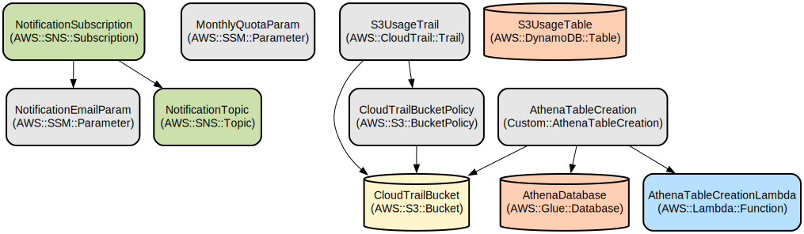

# S3 Usage Tracking System with Quota Management and Notifications

## Motivation

S3 data transfer costs can quickly escalate without proper monitoring, especially when users frequently download large files or when automated systems generate unexpected traffic patterns. Organizations often discover excessive data transfer charges only after receiving their monthly AWS bill, making it difficult to identify the source and take corrective action.

This project addresses these challenges by:
- **Proactive Cost Control**: Monitor data transfer in real-time to prevent unexpected charges
- **User Accountability**: Track individual user activity to identify high-usage patterns
- **Automated Alerts**: Notify administrators immediately when users exceed monthly quotas
- **Daily Reporting**: Provide comprehensive daily reports listing all users who have exceeded their allocated quotas
- **Historical Analysis**: Maintain usage history for trend analysis and capacity planning

By implementing this system, organizations can maintain visibility into their S3 data transfer costs, enforce usage policies, and take proactive measures to control expenses before they impact the budget.

## Overview

This project implements an automated S3 usage monitoring system that tracks data transfer activities, enforces monthly quotas, and sends notifications when usage thresholds are exceeded. It provides real-time visibility into S3 GetObject operations while helping organizations control and monitor their data transfer costs.

The system uses AWS CloudTrail to capture S3 GetObject events, processes them through AWS Athena for analysis, and stores usage metrics in DynamoDB. When users exceed their configured monthly data transfer quotas, the system automatically sends notifications via SNS. The solution includes optimized Lambda functions that efficiently process usage data and manage notifications with features like caching and batch processing.

## Repository Structure
```
.
├── s3-usage-tracker.yaml  # CloudFormation template defining infrastructure resources
```

## Usage Instructions
### Prerequisites
- AWS Account with appropriate permissions
- AWS CLI installed and configured
- Python 3.9 or later
- boto3 library

### Installation

1. Deploy the CloudFormation stack:
```bash
aws cloudformation create-stack \
  --stack-name s3-usage-tracker \
  --template-body file://s3-usage-tracker.yaml \
  --parameters \
    ParameterKey=NotificationEmail,ParameterValue=your-email@domain.com,your-second-email@domain.com \
    ParameterKey=MonthlyQuota,ParameterValue=100 \
  --capabilities CAPABILITY_IAM
```

2. Verify the deployment:
```bash
aws cloudformation describe-stacks \
  --stack-name s3-usage-tracker \
  --query 'Stacks[0].StackStatus'
```

## Data Flow
The system processes S3 usage data through a multi-stage pipeline that transforms raw CloudTrail logs into actionable usage metrics.

```ascii
CloudTrail Logs → S3 Bucket → Athena Query → Lambda → DynamoDB → SNS Notifications
     [Events]     [Storage]    [Analysis]   [Process] [Database]  [Alerts]
```

Component Interactions:
1. CloudTrail captures all S3 GetObject operations
2. Logs are stored in a dedicated S3 bucket with versioning enabled
3. Athena queries process logs hourly to extract usage metrics
4. Lambda functions aggregate usage data and check quotas
5. DynamoDB stores processed usage data with 90-day TTL
6. SNS sends notifications when quotas are exceeded
7. SSM Parameter Store maintains configuration values

## Infrastructure



Lambda Functions:
- `AthenaTableCreationLambda`: Creates Athena table for CloudTrail logs
- `S3UsageTracker`: Processes usage data and manages notifications

S3 Resources:
- `CloudTrailBucket`: Stores CloudTrail logs with versioning enabled

DynamoDB Tables:
- `S3UsageTable`: Stores processed usage metrics
- `NotificationTable`: Tracks sent notifications

SNS Resources:
- `NotificationTopic`: Handles quota exceeded notifications

CloudTrail:
- `S3UsageTrail`: Tracks S3 GetObject operations

Parameter Store:
- `/s3usage/notification-email`: Notification recipient
- `/s3usage/monthly-quota`: Monthly transfer quota